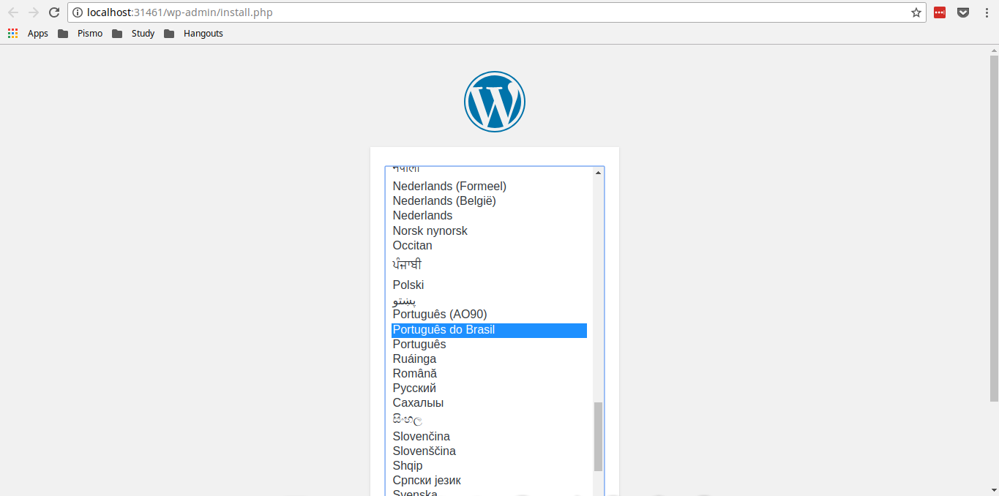

# Tanker - K8S Applications POC builder

<p align="center">
  
</p>

Tanker is a small project with the purpose of running in a local kubernetes cluster provided by [minikube](https://kubernetes.io/docs/getting-started-guides/minikube/#quickstart) to test your dockerized applications without suffering to configuring or setting up your environment.  

The idea behind it is: place your k8s *yamls into `k8s-apps/${YOUR-APP}/` and be happy! :D  

## Before you begin

Make sure that your machine follows the requisites:

- Ubuntu 18.04 or superior (there is a libvirt's group limitation that requires specific configuration by version, so it's better to stick with it)
- 3 GB or more of RAM (it needs to handle the virtualization as well)
- 2 CPUs or more

Ensure that you have `docker` both client and version `1.13.x` or superior  

## Getting Started

To run the app, just:  

`./tanker`  

<p align="center">
  
</p>

It will run a kubernetes cluster under kvm driver and exposes the URL to be tested locally from a demonstration Wordpress application.  

The first execution can take some time due to the virtual machine creation.  

## Running my own apps

You don't have to stick to the default 'wordpress' example project, to deploy your own kubernetes' application follow these steps:  

- create a dir located at `k8s-apps/` with the needed *.yamls
- add your app the list of apps (`KUBE_APPS`) located at `config/environment.sh`  
- run `./tanker` to create the new app  

Tanker will not give to you the exposed URL because it can vary due to specific configuration for you services. To check by yourself:  

`minikube service ${MY_SERVICE_NAME} --url`  

## Security

It's highly recommended that **you do not** use tanker in production environments. The purpose of this project is to setup a development environment the quickest way. After that the deployment of your POC must be done with a secure Kubernetes Cluster using one of the following tools: `kops` or `kubeadm`  

## Troubleshooting  

In order to run the app and follow line by line what happened, just set the environment variable `DEBUG` located at `config/environment.sh` as true. The next `./tanker` will output what is going on *under the hood*  

To wipe every minikube data due any additional problems when creating/running the cluster you can:

```
$ minikube stop # if started
$ minikube delete
$ rm -rf ~/.minikube
```

Then you can ask `./tanker` to create it again

## Why not kubeadm?

You must be wondering why the project just not use `kubeadm` to install a real cluster instead of a virtual one using `minikube`. The `kubeadm` may need some additional intrusive configuration such as kernel configurations and network changes which could break any other part of the system if used in a dev machine instead of a server. To keep it simple, the `minikube` handles the situation. 

## Next steps

The project is still under development, and it needs to handle a few things for the future:  

- The k8s cluster runs into a virtual machine that runs in a different subnet from the host, which means that exposing kubernetes' pods to the world can be a little difficult because demands an internal routing forward and will not be done automatically.  
- We are working with the possibility to solve the DNS locally automatically instead of just using the virtual machine IP from commands like: `minikube service ${SERVICE_NAME} --url`  